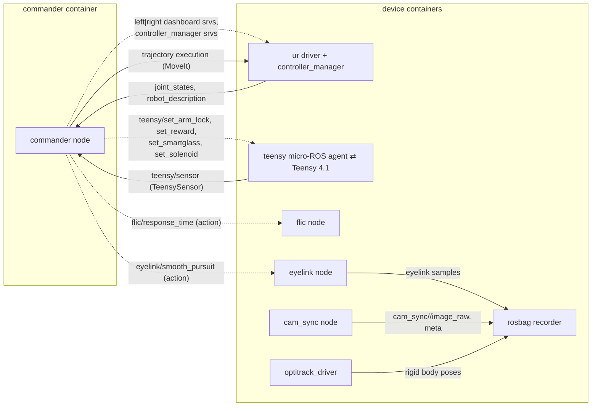
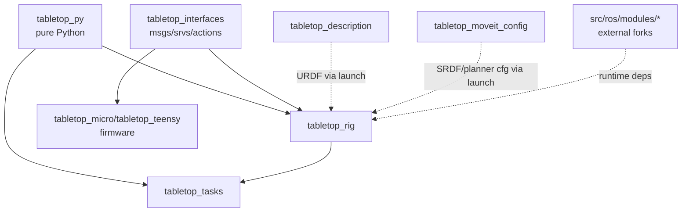

# TableTop System Architecture

A conceptual dependency map of the TableTop platform: how the pieces fit
together, who talks to whom, and where to look when something breaks.
Intended for new users, developers, and agents navigating the codebase.

> Scope: the core platform (`bin/`, `compose.yaml`, `src/tabletop_py`,
> `src/ros/tabletop/*`). External forks in `src/ros/modules/` and the
> `virtual_tabletop/` MuJoCo simulation are out of scope.

## 1. The Big Picture

The system is layered. Each layer only reaches *down*:

```
┌──────────────────────────────────────────────────────────────────┐
│ EXPERIMENTS   tabletop_tasks: ForagingTask, SmoothPursuitTask, … │
│               (YAML task configs → trial generators → trials)   │
├──────────────────────────────────────────────────────────────────┤
│ ORCHESTRATION tabletop_rig Commander node                        │
│               (aggregates interfaces: MoveIt, Teensy, Flic,      │
│                Eyelink, UR dashboard, Sound)                     │
├──────────────────────────────────────────────────────────────────┤
│ DEVICE NODES  one ROS 2 node per device, one Docker container    │
│               per node: ur driver, teensy (micro-ROS), flic,     │
│               eyelink, flir cameras, optitrack, rosbag           │
├──────────────────────────────────────────────────────────────────┤
│ ROS PLUMBING  tabletop_interfaces (msgs/srvs/actions),           │
│               tabletop_description (URDF), tabletop_moveit_config│
├──────────────────────────────────────────────────────────────────┤
│ PURE PYTHON   tabletop_py: gaze ML, flic protocol, utils         │
│               (no ROS dependency; imported by the layers above)  │
├──────────────────────────────────────────────────────────────────┤
│ INFRA         bin/ scripts → compose.yaml services → Docker      │
│               (.env generated by tt-env-gen; setup.bash env)     │
└──────────────────────────────────────────────────────────────────┘
```

All containers share `network_mode: host` and `ipc: host`, so every ROS
node sees every other node regardless of which container it runs in.

## 2. Infrastructure Layer

### 2.1 Environment flow

```
setup.bash ──(sourced by every script & container entrypoint)──▶ env vars
    │            TABLETOP_DIR, COLCON_WS, ROS_LOG_DIR, ROBOT_IP…
    ▼
tt-env-gen ──▶ .env  (from .env.example; detects GPU, FLIR devices,
    │                 Teensy serial, PulseAudio socket)
    ▼
tt-compose ──▶ docker compose (compose.yaml reads .env for devices,
                runtimes, mounts)
```

- `setup.bash` is the single source of environment truth. It detects
  host-vs-container via `TABLETOP_CONTAINER`, activates the right uv
  venv (`.venv` host / `.venv.container` container), sources ROS, and
  puts `bin/common` + `bin/host` or `bin/container` on `PATH`.
- `.env` must be regenerated (`tt-env-gen`) whenever hardware changes
  (cameras/Teensy plugged in) because device paths are baked into it.

### 2.2 `bin/` scripts — what each one actually runs

| Script | Where | Under the hood |
|---|---|---|
| `host/tt-compose` | host | `tt-env-gen` (if no `.env`) then `docker compose "$@"` |
| `host/tt-env-gen` | host | regenerates `.env` from `.env.example`; scans `/dev/flir/`, `nvidia-smi`, PulseAudio |
| `host/tt-build` | host | `tt-compose run --rm ros-base tt-build "$@"` |
| `host/tt-launch` | host | `tt-compose run --rm commander tt-launch "$@"` |
| `host/tt-microros-build` | host | `tt-compose run --rm microros-builder tt-microros-build "$@"` |
| `host/tt-dev-attach` | host | start service if needed, `docker compose exec <svc> /entrypoint.sh bash` |
| `host/tt-flir-reset` | host | stop flir svc → reload udev → `tt-launch flir factory_reset:=true` → restart |
| `container/tt-build` | container | `uv sync $UV_EXTRA` then `colcon build` (mixins: release/ccache/mold) |
| `container/tt-launch` | container | case-routes to `ros2 launch <pkg> <name>.launch.py`, sets per-target `ROS_LOG_DIR` |
| `container/tt-microros-build` | container | PlatformIO `pio run` in `tabletop_micro/tabletop_{teensy,flic_micro}` |
| `container/tt-create-graph` | container | `ros2_graph` → `docs/graph.md` |
| `container/tt-kill-ros` | container | `pkill -f ros` |
| `common/tt-clean` | both | `rm -rf` of build/install/log/cache dirs by flag |
| `common/tt-robot-scp` | both | `scp ur_robot/programs/*.urcap root@$ROBOT_IP:/programs` |

Host setup scripts (udev rules, usbfs size, CPU scaling, robot network)
live in `scripts/configure/`; one-time installers in `scripts/install/`.

### 2.3 Compose services × profiles

| Service | Profile(s) | Command | Devices / special |
|---|---|---|---|
| `ros-base` | builder | `tt-build --all` | bind-mounts repo at `/tabletop`; parent of all ROS services |
| `commander` | commander | `tt-launch commander` | GPU runtime if available, PulseAudio, bags mount |
| `ur` / `ur-mock` | real / sim | `tt-launch dual_ur robot_mode:=real\|mock` | rtprio ulimits |
| `teensy` / `teensy-sim` | real / sim | `tt-launch teensy simulate:=false\|true` | `$TEENSY_DEV` serial |
| `flic` / `flic-sim` | real / sim | `tt-launch flic simulate:=false\|true` | `NET_ADMIN` (BLE sniffing) |
| `eyelink` / `eyelink-sim` | real / sim | `tt-launch eyelink simulate:=…` | bags mount |
| `flir` | flir | `tt-launch flir_synchronized` | `$FLIR_DEV_0..5` USB devices |
| `optitrack` | real | `tt-launch optitrack` | |
| `rviz`, `foxglove` | real, sim | `tt-launch rviz\|foxglove` | rviz renders to noVNC display |
| `novnc` | real, sim, ursim | X11+VNC server | browse to `localhost:<NOVNC_PORT>/vnc.html` |
| `ursim` | ursim | UR simulator image | shares noVNC display |
| `autoheal` | real, sim, ursim | restarts unhealthy labeled containers | |
| `microros-builder` | — | `tt-microros-build` | privileged, `/dev`, platformio cache volume |
| `dev` | dev | `sleep infinity` | the Dev Container; everything mounted |

A typical real-hardware session: `tt-compose --profile=real up` starts
ur + teensy + flic + eyelink + optitrack + rviz + novnc, then
`tt-launch tasks task:=…` runs a commander container on top.

## 3. ROS Runtime Graph

Who talks to whom at runtime (solid = topic, dashed = service/action):



Key edges:

- **Safety loop**: Teensy firmware publishes `teensy/sensor` at 100 Hz;
  `TeensyInterface` (inside Commander) gates every robot motion through
  `safe_to_execute`. Note: only the safety-laser field is currently
  enforced — the arm-lock check is commented out (see `known-issues.md`).
- **Hardware sync**: the Teensy emits a hardware trigger pulse wired to
  the FLIR cameras' Line0, so all cameras expose simultaneously; the
  synchronized driver stamps grouped frames identically.
- **MoveIt runs inside the Commander process** (`moveit_py`), not as a
  separate `move_group` node — planning is in-process, execution goes
  to the UR `controller_manager` action servers.

## 4. Launch & Configuration

### 4.1 Launch hierarchy

```
tasks.launch.py (tabletop_tasks)         task:=<name> ⇒ coro_config=config/<name>.yaml
└── rig.launch.py (tabletop_rig)         per-subsystem *_launch:=true|false toggles
    ├── commander.launch.py              → commander node (+ moveit_cpp config)
    ├── ur.launch.py / dual_ur.launch.py → ur driver stack
    │   └── dual_rsp.launch.py (tabletop_description) → robot_state_publisher (URDF)
    ├── teensy.launch.py                 → micro_ros_agent  | mock_teensy (simulate)
    ├── flic.launch.py                   → flic node
    ├── eyelink.launch.py                → eyelink node
    ├── optitrack.launch.py              → mocap4r2 lifecycle driver
    ├── flir.launch.py                   → per-camera CameraDriver components
    ├── rviz.launch.py                   → rviz2 (waits for robot_description)
    └── rosbag.launch.py                 → ros2 bag record (topics from rosbag.yaml)

flir_synchronized.launch.py              → SynchronizedCameraDriver component (standalone)
moveit.launch.py (tabletop_moveit_config)→ standalone move_group + rviz (debug only)
```

### 4.2 Config file → consumer map

| Config | Consumed by | Drives |
|---|---|---|
| `tabletop_rig/config/commander.yaml` | commander.launch.py → Commander node | all interface parameters (see §5.3) |
| `tabletop_rig/config/flir_synchronized.yaml` | flir_synchronized.launch.py | camera list, serials, trigger/chunk settings, poses |
| `tabletop_rig/config/flir.yaml`, `blackfly_s.yaml` | flir.launch.py | unsynchronized per-camera params |
| `tabletop_rig/config/dual_controllers.yaml` | dual_ur.launch.py → controller_manager | left/right controller definitions |
| `tabletop_rig/config/update_rate.yaml` | ur_control/dual_ur/multi_ur launch → controller_manager | ros2_control update rate (Hz) |
| `tabletop_rig/config/optitrack.yaml` | optitrack.launch.py | server address, ports, QoS |
| `tabletop_rig/config/rosbag.yaml` | rosbag.launch.py | recorded topics/services, bag size |
| `tabletop_rig/config/object_reset/*.yaml` | Commander reset_object requests | reset motion parameters |
| `tabletop_tasks/config/<task>.yaml` | tasks.launch.py → run_tasks coroutine | task class + kwargs + trial generator |
| `tabletop_description/config/*_calibration.yaml` | (dual_)rsp.launch.py | per-arm UR kinematics |
| `tabletop_moveit_config/config/*.yaml` | commander.launch.py, moveit.launch.py | planners, limits, controllers |

### 4.3 Parameter flow (config → code)

```
config/commander.yaml
  └─ launch ParameterFile ─▶ Commander node parameters (flat, dot-separated)
       └─ BaseNode.param("x.y.z") / get_nested_parameters(prefix)
            └─ BaseInterface.param(name) — resolves "<iface_prefix>.<name>"
               with fallback to "common_<kind>_interface.<name>"
```

Example: `left_ur_interface.namespace` is read by the left
`URInterface`; anything it doesn't override falls back to
`common_ur_interface.*`. The same common/override pattern appears in
`flir_synchronized.yaml` (`camera_params_common` vs `camera_params`)
and task configs.

## 5. Package & Code-Level Dependencies

### 5.1 Package import graph



- `tabletop_py` never imports ROS. `tabletop_rig` is the only package
  that wraps it in ROS nodes. `tabletop_tasks` only consumes the
  `Commander`; it never touches devices directly.
- `tabletop_micro/` is `COLCON_IGNORE`d — firmware is built by
  PlatformIO (`tt-microros-build`), not colcon, but it *implements*
  the `tabletop_interfaces` services in C.

### 5.2 tabletop_rig internals

Nodes (`tabletop_rig/nodes/`, lazy-imported via PEP 562):

| Node | Entry point | Role |
|---|---|---|
| `Commander` | `commander` | orchestrator; owns all interfaces; runs task coroutine |
| `Flic` | `flic` | BLE button → `flic/response_time` action |
| `Eyelink` | `eyelink` | eye tracker samples + `eyelink/smooth_pursuit` action |
| `MockTeensy` | `mock_teensy` | simulates firmware topics/services |
| `MockDashboardClient` / `MockRobotStateHelper` | `mock_*` | simulate UR driver helpers in mock mode |
| `SystemCheck` | `system_check` | live diagnostics (e.g. FLIR sync check) |

Interface composition inside the Commander:

```text
Commander (BaseNode)
 ├── TeensyInterface         teensy srv clients + sensor subscription
 ├── FlicInterface           flic action client
 ├── EyelinkInterface        eyelink action client
 ├── SoundInterface          fluidsynth audio feedback
 ├── MoveItInterface         one shared instance (MoveItPy + planning scene)
 └── ManipulationContextManager ×N   one per arm (from robot_interface_names)
       ├── URInterface              dashboard + recovery state machine
       └── ObjectManipulationInterface  pick/present/return state machine,
              holds a reference to the shared MoveItInterface
```

Every interface extends `BaseInterface`; the relationship is **composition,
not a single linear inheritance chain**:

```text
BaseInterface
 ├── MoveItInterface              MoveItPy, planning scene, collision objects, ACM
 ├── PlanAndExecuteInterface      plan/execute + trajectory cache
 │     └── ObjectManipulationInterface   (composes a MoveItInterface by reference)
 ├── URInterface
 ├── TeensyInterface / FlicInterface / EyelinkInterface / SoundInterface
 └── ManipulationContextManager   (bundles a URInterface + ObjectManipulationInterface)
```

- `ObjectManipulationInterface` is a pick/present/return state machine
  (`ManipulationState` enum); invalid transitions raise
  `StateTransitionError` (see `exceptions.py` for the full hierarchy).
- `PlanAndExecuteInterface` consults the trajectory cache
  (`trajectory_cache*.py`, LMDB + KD-tree fuzzy lookup) before
  re-planning.
- `executors.py` provides the asyncio-bridging executors. Note the
  hard-won lessons in `musings.md`: the Commander must use the
  thread-based executor, and the UR driver must run in a separate
  process from the Commander.

### 5.3 tabletop_tasks internals

```
run.py: run_tasks(commander, config_file)     ← coroutine injected via
  loads tasks: [{class, kwargs}] from YAML       commander.launch.py
    └─ tasks/base.py
         BaseTask(run)                 — owns a Commander reference
         BaseObjectInteractionTask     — generic trial loop:
            trial_generator → TrialSpec → run_trial() → TrialFeedback
       tasks/{foraging,present,smooth_pursuit,dummy}.py
    └─ trial_generators/
         BaseTrialGenerator (iterator + send() feedback protocol)
         {ordered,random}_choice[_alternating].py, blocked_cup_drawer.py
```

### 5.4 tabletop_py usage map

| Module | Used by |
|---|---|
| `utils/common.py` (yaml/dict helpers) | rig `nodes/base`, `utils/logging`, `utils/ros`, interfaces, tasks `run.py` |
| `utils/mesh.py` | rig `interfaces/moveit/object_manipulation.py` (collision meshes) |
| `flic/scapy_client.py` | rig `nodes/flic.py` |
| `gaze/*` (edf, preprocess, models, train…) | rig `nodes/eyelink.py` + offline CLI tools (`tt-gaze-*` entry points in `pyproject.toml`) |

## 6. Where to Look When Something Breaks

| Symptom | Start here | Then |
|---|---|---|
| `tt-*` command not found | `source setup.bash` | `bin/` PATH logic in setup.bash |
| Container can't see camera/Teensy | `tt-env-gen` then `tt-compose ps` | `.env` `FLIR_DEV_*`/`TEENSY_DEV`, `compose.yaml` devices |
| Robot won't move, no error | Teensy safety loop | `interfaces/teensy.py: safe_to_execute`, arm-lock hardware |
| "Joint outside bounds" on start | robot was manually moved | musings.md → Robot §2 |
| Planning fails / slow | trajectory cache + planner config | `interfaces/moveit/plan_and_execute.py`, `tabletop_moveit_config/config/` |
| Pick/place stuck in weird state | manipulation state machine | `interfaces/moveit/object_manipulation.py` (`ManipulationState`) |
| Cameras out of sync / missing frames | `ros2 run tabletop_rig system_check` | `flir_synchronized.yaml` trigger settings, Teensy sync pulse |
| Flic button not responding | flic container logs | musings.md → Flic section (bluetooth voodoo) |
| Task behaves wrong | the task's YAML config | `tabletop_tasks/config/<task>.yaml` → task class kwargs |
| Commander hangs on shutdown | signal handling notes | musings.md → "Commander signal handling" |
| No sound in container | PulseAudio mount | `tt-env-gen` PULSE_* detection, `compose.yaml` commander mounts |

## 7. Related Documents

- `README.md` — setup and quick start
- `musings.md` — battle-tested troubleshooting notes
- `docs/graph.md` — auto-generated runtime node graph (`tt-create-graph`)
- `docs/known-issues.md` — discrepancies found during documentation review
