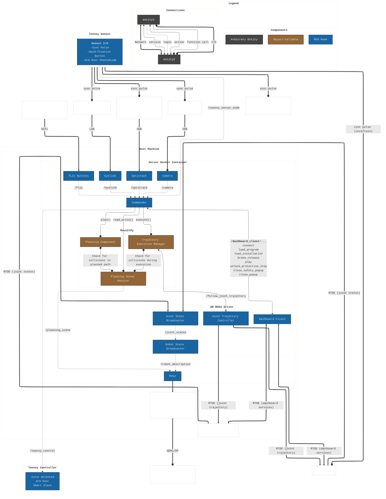

```mermaid
---
config:
    flowchart:
        defaultRenderer: elk
    elk:
        mergeEdges: false
        nodePlacementStrategy: # BRANDES_KOEPF NETWORK_SIMPLEX, SIMPLE, LINEAR_SEGMENTS
        cycleBreakingStrategy: # GREEDY, DEPTH_FIRST, INTERACTIVE, MODEL_ORDER, GREEDY_MODEL_ORDER
    fontFamily: JetBrains Mono, monospace
---
flowchart TD
subgraph legend[<b>Legend<b/>]

    subgraph nodes[<b>Components<b/>]
        object[Object/Callable]:::object
        node[ROS Node]:::node
        entity[Arbitrary Entity]:::entity
    end

    subgraph connection[<b>Connections<b/>]
        entity1[entity1]:::entity
        entity2[entity2]:::entity
    end
end

subgraph host_machine[<b>Host Machine<b/>]

    subgraph rig_container[<b>Server Docker Container<b/>]
        subgraph moveit_py[<b>MoveItPy<b/>]
            planning_scene_monitor[Planning Scene Monitor]:::object
            planning_component[Planning Component]:::object
            trajectory_execution[Trajectory Execution Manager]:::object

        end

        subgraph ur_driver[<b>UR ROS2 Driver<b/>]
            dashboard_client[Dashboard Client]:::node
            joint_trajectory_controller[Joint Trajectory Controller]:::node
            joint_state_broadcaster[Joint State Broadcaster]:::node
            robot_state_broadcaster[Robot State Broadcaster]:::node

        end

        commander[Commander]:::node
        rviz[RViz]:::node
        flic_buttons_node[FLIC Buttons]:::node
        eyelink_node[Eyelink]:::node
        optitrack_node[Optitrack]:::node
        camera_node[Camera]:::node
    end

    novnc_container["`**NoVNC Docker Container**
        Exposes GUI to host machine via web interface`"]
    ursim_container["`**UR Sim Container**
        Simulates UR robot`"]

end

subgraph teensy_sensor[<b>Teensy Sensor<b/>]
    teensy_sensor_node["`**Sensor I/O**
        -Sync Pulse
        -Hand-fixation Button
        -Arm Door Photodiode
        `"]:::node
end
subgraph teensy_controller[<b>Teensy Controller<b/>]
    teensy_controller_node["`
        Juice Solenoid
        Arm Door
        Smart Glass
    `"]:::node
end

flic_buttons["`**FLIC Buttons**
    For monkey goal trigger`"]
eyelink["`**EyeLink**
    For eye tracking`"]
optitrack["`**Optitrack**
    Pose tracking of objects and monkey arm`"]
camera["`**Camera**
    For monitoring`"]
open_ephys["`**Open Ephys**
    For recording neural activity`"]
monitor["`**Monitor**
    For displaying GUI elements`"]

ur_robot["`**UR Robot**`"]


entity1 <-->|service| entity2
entity1 -.->|topic| entity2
entity1 x--x|action|entity2
entity1 --o|function call| entity2
entity1 o==o|I/O| entity2
entity1 <==>|Network| entity2

teensy_sensor_node -.->|/teensy_sensor_node| commander
teensy_sensor ==o|sync pulse| eyelink
teensy_sensor ==o|sync pulse| optitrack
teensy_sensor ==o|sync pulse| camera
teensy_sensor ==o|sync pulse| open_ephys
teensy_sensor ==o|"sync pulse (uncertain)"| ur_robot

flic_buttons ==>|Wifi| flic_buttons_node
eyelink ==>|LAN| eyelink_node
optitrack ==>|USB| optitrack_node
camera ==o|USB| camera_node

flic_buttons_node -.->|/flic| commander
eyelink_node -.->|/eyelink| commander
optitrack_node -.->|/optitrack| commander
camera_node -.->|/camera| commander

commander --o|"plan()"| planning_component
commander --o|"execute()"| trajectory_execution
commander --o|"read_write()"| planning_scene_monitor
commander <-->|"`**/dashboard_client/...**
    connect
    load_program
    load_installation
    brake_release
    play
    unlock_protective_stop
    close_safety_popup
    close_popup
    `"| dashboard_client
commander -.->|/teensy_control| teensy_controller_node

planning_component o--o|"Check for collisions in planned path"| planning_scene_monitor
trajectory_execution o--o|"Check for collisions during execution"| planning_scene_monitor
trajectory_execution x--x|/follow_joint_trajectory| joint_trajectory_controller
planning_scene_monitor -.->|/planning_scene| rviz

dashboard_client <==>|"RTDE (dashboard services)"| ursim_container
dashboard_client <==>|"RTDE (dashboard services)"| ur_robot
joint_trajectory_controller ==>|"RTDE (joint trajectory)"| ursim_container
joint_trajectory_controller ==>|"RTDE (joint trajectory)"| ur_robot
joint_state_broadcaster -.->|/joint_states| robot_state_broadcaster
robot_state_broadcaster -.->|/robot_description| rviz

rviz ==> novnc_container
novnc_container ==o|HDMI/DP| monitor

ursim_container ==>|"RTDE (joint states)"| joint_state_broadcaster
ur_robot ==>|"RTDE (joint states)"| joint_state_broadcaster
ursim_container ~~~ ur_robot

classDef node opacity:0.9,fill:#059,stroke:#000,stroke-width:1px,color:#FFF
classDef object opacity:0.9,fill:#852,stroke:#000,stroke-width:1px,color:#FFF
classDef device opacity:0.9,fill:#464,stroke:#000,stroke-width:1px,color:#FFF
classDef entity opacity:1.0,fill:#444

style legend opacity:0.15,fill:#FFF
style nodes opacity:0.15,fill:#FFF
style connection opacity:0.15,fill:#FFF
style host_machine opacity:0.15,fill:#FFF
style rig_container opacity:0.15,fill:#FFF
style moveit_py opacity:0.15,fill:#FFF
style ur_driver opacity:0.15,fill:#FFF
style novnc_container opacity:0.15,fill:#FFF
style ursim_container opacity:0.15,fill:#FFF
style monitor opacity:0.15,fill:#FFF
style teensy_sensor opacity:0.15,fill:#FFF
style teensy_controller opacity:0.15,fill:#FFF
style flic_buttons opacity:0.15,fill:#FFF
style eyelink opacity:0.15,fill:#FFF
style optitrack opacity:0.15,fill:#FFF
style camera opacity:0.15,fill:#FFF
style open_ephys opacity:0.15,fill:#FFF
style ur_robot opacity:0.15,fill:#FFF

%% linkStyle default stroke:#333,stroke-width:2px,fill:none
```
